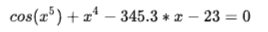

# Основы 

3.1. Найти корень уравнения

Задача
--------

Найдите корень уравнения

на отрезке [0; 10] с точностью по x не хуже, чем 0.001. Известно, что на этом промежутке корень единственный.
Используйте для этого метод деления отрезка пополам (и рекурсию).

Решение:
--------

        // вспомогательный метод
    public static double func(double x){
        return Math.cos(Math.pow(x, 5)) + Math.pow(x, 4) - 345.3 * x - 23;
    }

    // решить уравнение
    public static double  solve(double start, double end){
        if(end - start <= 0.001){
            return start;
        }

        double x = start + (end - start) / 2;

        if(func(start) * func(x) > 0){
            return solve(x, end);
        } else {
            return solve(start, x);
        }
    }

    public static void main(String[] args) {
        System.out.println(solve(0, 10)); 
    }

Замечание: если мы хотим добиться нужной точности не по x, по y, то условие в методе следует переписать:

        if(Math.abs(func(start)- func(end)) <= 0.001){
            return start;
        }

Маленькая хитрость: учитывая, что множество значений double конечно (есть два соседних значения, между которыми нет ни одного значения double), условие выхода из рекурсии переписать так:

        double x = start + (end - start) / 2;
        if(x == end || x == start){
            return x;
        }

Таким образом получим максимальную точность, которую вообще можно получить, используя этот подход.